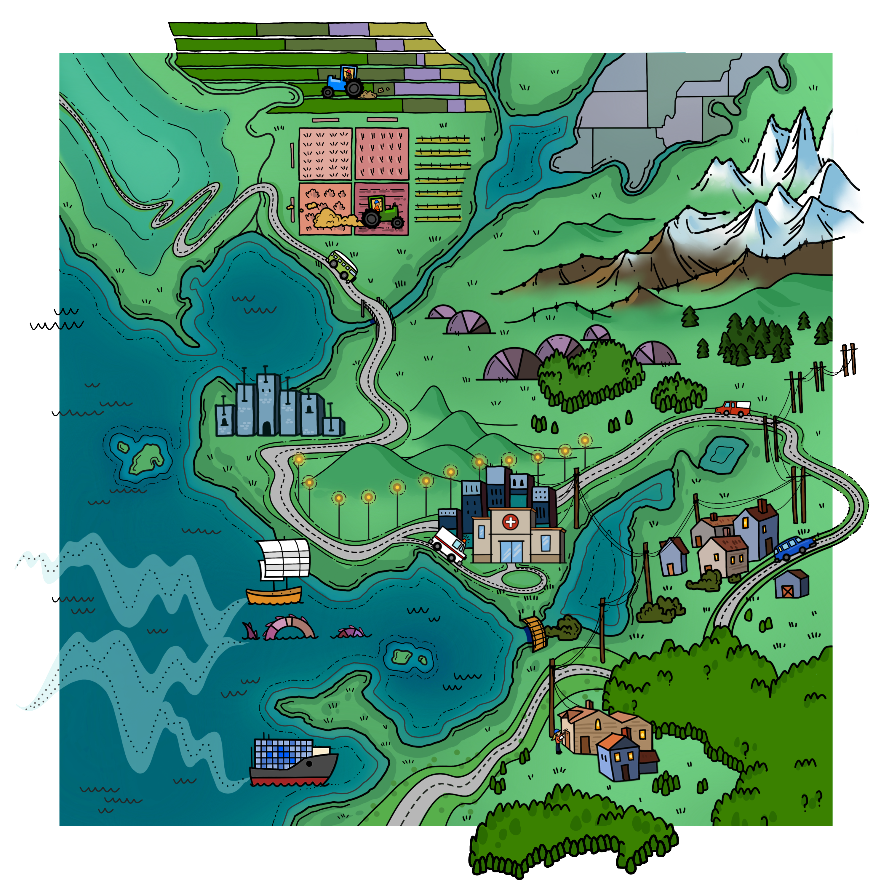

<br>

::::: {.hero}

:::: {.hero-banner}

::: {.hero-deco}
{.deco .deco-pie fig-alt=""}
{.deco .deco-donut .float fig-alt=""}
:::

::: {.hero-text}

<span class="book-label">A Chapman & Hall / CRC Book · 2024</span>

# Exploring<br><span class="squiggle-wrap"><i>Complex Survey</i><svg class="squiggle" viewBox="0 0 300 14" preserveAspectRatio="none" aria-hidden="true"><path d="M2,8 Q40,2 80,7 T160,6 T240,8 T298,5" stroke="currentColor" stroke-width="3" fill="none" stroke-linecap="round" /></svg></span><br>Data Analysis<br>Using R

A Tidy Introduction with {srvyr} and {survey}

<br>

<a href="https://tidy-survey-r.github.io/tidy-survey-book/" target="_blank" class="btn btn-dark" href="#">Read the book --- free →</a> <a class="btn btn-light" href="#buy-book">Where to buy</a>
:::

::: {.hero-image}

::: {.cover-stage}
{.tilt .img-float}

[library(srvyrexploR)]{.chip .chip-1}
[survey_count()]{.chip .chip-2 .chip-dark}
[as_survey_design()]{.chip .chip-3 .chip-accent}

::: 
:::

::::

:::::

::::: {.white-bg}

<span class="section-label">About the book</span>

# From raw weights to publishable findings

:::: columns

::: {.column width="48%"} 

Surveys are powerful tools for gathering information, uncovering insights, and facilitating decision-making. However, to ensure the accurate interpretation of results, they require specific analysis methods.

In this book, readers embark on an in-depth journey into conducting complex survey analysis with the {srvyr} package and tidyverse family of functions from the R programming language. Intended for intermediate R users familiar with the basics of the tidyverse, this book gives readers a deeper understanding of applying appropriate survey analysis techniques using {srvyr}, {survey}, and other related packages.

:::

::: {.column width="4%"}
:::

::: {.column width="48%"}

```{=html}
<div class="dataset-box">
<span class="section-label">Featured datasets</span>
  <div class="row-item">
    <div class="code">ANES</div>
    <div class="text">
      <div class="desc">American National Election Studies</div>
      <div class="sub">Demographics and voting</div>
    </div>
  </div>

  <div class="row-item">
    <div class="code">RECS</div>
    <div class="text">
      <div class="desc">Residential Energy Consumption Survey</div>
      <div class="sub">Energy and housing</div>
    </div>
  </div>

  <div class="row-item">
    <div class="code">NCVS</div>
    <div class="text">
      <div class="desc">National Crime Victimization Survey</div>
      <div class="sub">Public safety</div>
    </div>
  </div>

  <div class="row-item">
    <div class="code"></div>
    <div class="text">
      <div class="desc">AmericasBarometer</div>
      <div class="sub">Public opinion</div>
    </div>
  </div>

</div>
```
:::

::::

<br>

::: {#chapter-listing}
:::

:::::

:::::: {.lightblue-bg}

<span class="section-label">Where to get the book </span>

# [Read it free on the web, or ship one home in print]{#buy-book}

::::: columns

:::: {.column width="48%"}

::: {.rounded-box}
<span class="section-label">FREE ONLINE EDITION · OPEN ACCESS</span>

[The full book, on the web]{.span style="font-size: 1.5rem; font-weight: 600;"}

[tidy-survey-r.github.io/tidy-survey-book](https://tidy-survey-r.github.io/tidy-survey-book){.span style="font-family: monospace;"}

<a href="https://tidy-survey-r.github.io/tidy-survey-book/" target="_blank" class="btn btn-dark" href="#">Open the book ↗</a> 

:::

::::

:::: {.column width="4%"}
::::

:::: {.column width="48%"}

::: {.rounded-box}

<span class="section-label">↳ PRINT & EBOOK RETAILERS</span>

- [Routledge](https://www.routledge.com/Exploring-Complex-Survey-Data-Analysis-Using-R-A-Tidy-Introduction-with-srvyr-and-survey/Zimmer-Powell-Velasquez/p/book/9781032302867)
- [Your local bookstore in USA](https://bookshop.org/p/books/exploring-complex-survey-data-analysis-using-r-a-tidy-introduction-with-srvyr-and-survey-rebecca-powell/21474544?ean=9781032302867)
- [Your local bookstore in Canada](https://www.indiebookstores.ca/book/9781032302867/)
- [Your local bookstore in the UK](https://uk.bookshop.org/p/books/exploring-complex-survey-data-analysis-using-r-a-tidy-introduction-with-srvyr-and-survey-isabella-velasquez/7688018)
- [Amazon](https://www.amazon.com/Exploring-Complex-Survey-Analysis-Using/dp/1032302860)

:::

::::

:::::

::::::

::::: {.darkblue-bg}

<span class="section-label">Companion data package</span>

# All the datasets in one tidy R package

:::: columns

::: {.column width="48%"}

Examples throughout the book include usage of several datasets. Most of these datasets are included in the R package {srvyrexploR} available on GitHub.

<a class="btn btn-light" href="https://tidy-survey-r.github.io/srvyrexploR/">View on GitHub ↗</a>

:::

::: {.column width="4%"}
:::

::: {.column width="48%"}

::: {.code-card}

```r
library(tidyverse)
library(survey)
library(srvyr)
library(srvyrexploR)

targetpop <- 231592693

anes_adjwgt <- anes_2020 %>%
  mutate(Weight = Weight / sum(Weight) * targetpop)

anes_des <- anes_adjwgt %>%
  as_survey_design(
    weights = Weight,
    strata = Stratum,
    ids = VarUnit,
    nest = TRUE
  )
```

:::
:::

::::

:::::

::::: {.white-bg}

# About the authors

::: {#author-listing}
:::

:::::