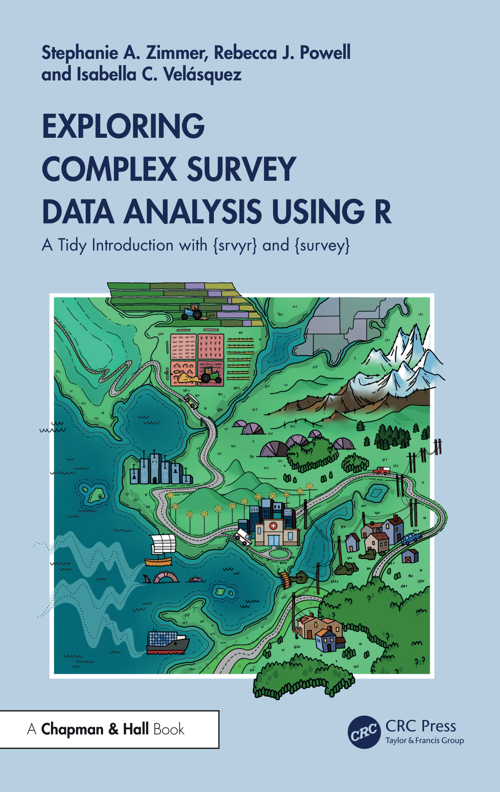

## About us

:::: {.columns style="text-align: center"}

::: {.column width="33%"}

<b>Stephanie Zimmer</b>

RTI International
:::

::: {.column width="33%"}

<b>Rebecca Powell</b>

Fors Marsh
:::

::: {.column width="34%"}

<b>Isabella Velásquez</b>

Posit
:::

::::

## Overview

- Using R for survey analysis
- Setting up your analysis
- Introducing databases
- Calculating means
- Conducting t-tests
- Creating tables
- Wrap up

# Introduction to {survey} and {srvyr} {background-color=''}

## R packages for survey analysis {.smaller}

- {survey} package first on CRAN in 2003
    - descriptive analysis
    - statistical testing
    - modeling
    - weighting
- {srvyr} package first on CRAN in 2016
    - "wrapper" for {survey} with {tidyverse}-style syntax
    - only descriptive analysis
- {gtsummary} package first on CRAN in 2016
    - creates publication-ready tables from survey data
    - currently cannot handle replicate weights

::: {.notes}
- R packages are a collection of functions
- This is not an exhaustive list of packages that work with survey data
- Several packages for imputation, more complex weighting, and more
- gtsummary won't be discussed today
:::

## Comparison with dplyr

- dplyr: summary functions called within `summarize()`

### dplyr

```{r}
#| label: dplyr-load
#| echo: false
library(dplyr)
library(gt)
```

```{r}
#| label: dplyr-towny-example
#| code-line-numbers: "|1|2|3,6|4,5|"
towny %>%
  group_by(status) %>%
  summarize(
    area_mean = mean(land_area_km2),
    area_median = median(land_area_km2)
  )
```

## Comparison with dplyr

- srvyr: `survey_*()` functions called with `summarize()`

### srvyr

```{r}
#| label: apistrat-set-up
#| echo: false

library(srvyr)
data(api, package = "survey")

apistrat_des <- apistrat %>%
  as_survey_design(
    strata = stype,
    weights = pw
  )
```

```{r}
#| label: srvyr-api-example
#| code-line-numbers: "|1|2|3,6|4,5|"
apistrat_des %>%
  group_by(stype) %>%
  summarize(
    api00_mean = survey_mean(api00),
    api00_med = survey_median(api00)
  )
```

::: {.notes}
- If you already use {tidyverse}/{dplyr}, the syntax {srvyr} will come easily
- Functions commonly used like group_by, filter, and summarize also used in srvyr
- Note that the survey estimates also generate standard deviations - can also add options to get CIs, deffs, and variances
:::

# Survey analysis process {background-color=''}

## Steps for descriptive analysis

1. Create a `tbl_svy` object (a survey object) using: `as_survey_design()` or `as_survey_rep()`

2. Subset data (if needed) using `filter()` (to create subpopulations)

**3. Specify domains of analysis using `group_by()`**

**4. Within `summarize()`, specify variables to calculate, including means, totals, proportions, quantiles, and more**

::: {.notes}
- Survey object involves specifying weights, strata and/or clusters (PSUs) OR replicate weights
- Survey object can be used over and over for the same data and different analyses
- This is necessary for getting appropriate weighted estimates and standard errors. More public use files are providing this syntax
- Can also use `cascade()` instead of `summarize()` to get the total row
:::

## Steps for testing

1. Create a `tbl_svy` object (a survey object) using: `as_survey_design()` or `as_survey_rep()`

2. Subset data (if needed) using `filter()` (to create subpopulations)

**3. Use `svyttest()` for comparisons of proportions and means, `svygofchisq()` for GOF test, or `svychisq()` for test of independence and test of homogeneity**

::: {.notes}
- Only last step changes from descriptive analysis. 
:::


## Steps for modeling

1. Create a `tbl_svy` object (a survey object) using: `as_survey_design()` or `as_survey_rep()`

2. Subset data (if needed) using `filter()` (to create subpopulations)

**3. Use `svyglm()` for linear models and logistic models, `svycoxph()` for Cox proportional-hazards, `svykm()` for Kaplan-Meier, `svyloglin()` for log-linear models, `svyolr()` for multinomial**

::: {.notes}
- Only last step changes from descriptive analysis. Syntax mirrors glm, coxph, etc functions for non-survey data
:::

# Load packages and data {background-color=''}

## Load packages

```{r}
#| label: load-pack
# install.packages(c("survey", "srvyr", "duckdb", "dbplyr", "gt"))
library(survey)
library(srvyr)
library(duckdb)
library(dbplyr)
library(gt)
```

## Today's data

Data from the 2021 Census of Population conducted by Statistics Canada

- Public-use microdata from the long-form census sample, named `data_donnees_2021_ind_v2.csv`
- Analysis uses survey weights and replicate weights provided with the data
- 980,868 rows and 144 columns (604 MB)
- Available online at: <https://www150.statcan.gc.ca/n1/pub/98m0001x/index-eng.htm>

## Database detour

- Initiate DuckDB database
- Load CSV into database - data does NOT go into RAM
- nread creates a small check that the number of records loaded as expected

```{r}
#| label: load-data
con <- dbConnect(duckdb())
nread <- duckdb_read_csv(
  conn = con,
  name = "c2021_ind",
  here::here("RawDat", "data_donnees_2021_ind_v2.csv")
)

nread
```

::: {.notes}
- For this example, we create a duckdb database. You could be pointing to existing database
:::

## Database tables in R {.smaller}

- Make a R object pointing to the table
- This R object is NOT a data.frame

```{r}
#| label: load-data-tab-ref

c2021_ind_db <- dplyr::tbl(con, I("c2021_ind"))
object.size(c2021_ind_db) %>% print(units="Gb")
c2021_ind_db
```

# Design object {background-color=''}

::: {.notes}
- After loading packages and data
- First step is to create design object
- Account for the sampling design or replicate weights
- Accurately calculate the estimates (using the correct underlying formulas)
- There are two functions for creating the design object depending on if using replicate weights or not
:::

## Syntax: replicate weights

For studies with replicate weights, create the survey object using the `as_survey_rep()` function. 

```r
as_survey_rep(
  .data,
  variables = NULL,
  weights = NULL,
  repweights = NULL,
  type = c("BRR", "Fay", "JK1", "JKn", "bootstrap", 
           "successive-difference", "ACS", "other"),
  combined_weights = TRUE,
  rho = NULL,
  bootstrap_average = NULL,
  scale = NULL,
  rscales = NULL,
  fpc = NULL,
  fpctype = c("fraction", "correction"),
  mse = getOption("survey.replicates.mse"),
  degf = NULL,
  ...
)
```

## Syntax: replicate weights {auto-animate=true}

For studies with replicate weights, create the survey object using the `as_survey_rep()` function. 

```{r}
#| label: survey-rep-hl-weights
#| eval: false
#| code-line-numbers: "4|5|6,7|9,11,12,15"
as_survey_rep(
  .data,
  variables = NULL,
  weights = NULL,
  repweights = NULL,
  type = c("BRR", "Fay", "JK1", "JKn", "bootstrap", 
           "successive-difference", "ACS","other"),
  combined_weights = TRUE,
  rho = NULL,
  bootstrap_average = NULL,
  scale = NULL,
  rscales = NULL,
  fpc = NULL,
  fpctype = c("fraction", "correction"),
  mse = getOption("survey.replicates.mse"),
  degf = NULL,
  ...
)
```

::: {.notes}
- As with the first function, there is a `weights` argument for the main analytic weight
- Also has the `repweights` argument to indicate the variables that hold the replicate weights
- Need to include the type of replicate weights: Balanced Repeated Replicates (BRR), Fay, Jackknife (JK), etc.
- Have separate arguments for the various parameters for the replicate weights: rho, scale, etc.
:::

## Implementation - design object

```{r}
#| label: create-design-object
cens_des <- c2021_ind_db %>%
  as_survey_rep(
    weights = WEIGHT, # <1>
    repweights = WT1:WT16, # <2>
    type = "other",
    scale = 1/35, # <3>
    mse = TRUE, # <4>
    rscales = 1) # <5>
```

1. Main analytic weight in `WEIGHT` variable
2. Replicate weights start with `WT1`-`WT16` variables
3. Scaling per documentation is dividing by 35
4. Center replicates around main estimate, not mean of replicates
5. When specifying `type="other"`, must specify rscales

::: {.notes}
- Using the documention for the 2021 Canadian Census, learn the variable names for the weights, the type, and the scale
:::

## Results {.smaller}

- Design object contains all the design data (i.e., replicate weights)
- Remaining data is in the database only
- Efficiency opportunity: specify degrees of freedom when creating design object

```{r}
#| label: view-design-object
object.size(cens_des) %>% print(units="Gb")
cens_des
```


# Calculate means {background-color=''}

## Syntax

The `survey_mean()` calculates means while taking into account the survey design elements.

```{r}
#| eval: false
#| label: mean-syntax
#| code-line-numbers: "|2|4,5|6,7|8,9"
survey_mean(
  x,
  na.rm = FALSE,
  vartype = c("se", "ci", "var", "cv"),
  level = 0.95,
  proportion = FALSE,
  prop_method = c("logit", "likelihood", "asin", "beta", "mean"),
  deff = FALSE,
  df = NULL
)
```


## Implementation

Calculate the estimated average cost of housing (`SHELCO`) in Canada:

:::fragment
```{r}
#| eval: false
#| label: calc-mean-hl-des
#| code-line-numbers: "|1"
cens_des %>%
  summarize(housing_cost = survey_mean(SHELCO, 
                                       vartype = c("se", "ci"))) 
```
:::

:::fragment
- Use the survey design object, not raw data
:::

## Implementation {auto-animate=true}

Calculate the estimated average cost of housing (`SHELCO`) in Canada:

```{r}
#| eval: false
#| label: calc-mean-hl-summary
#| code-line-numbers: '2'
cens_des %>%
  summarize(housing_cost = survey_mean(SHELCO, 
                                       vartype = c("se", "ci"))) 
```

- Use the survey design object, not raw data
- Call `survey_mean()` *within* `summarize()` function

## Implementation {auto-animate=true}

Calculate the estimated average cost of housing (`SHELCO`) in Canada:

```{r}
#| eval: false
#| label: calc-mean-hl-vartype
#| code-line-numbers: '3'
cens_des %>%
  summarize(housing_cost = survey_mean(SHELCO, 
                                       vartype = c("se", "ci"))) 
```

- Use the survey design object, not raw data
- Call `survey_mean()` *within* `summarize()` function
- Specify the type of variance output, here we output the standard error and confidence interval

## Results

Calculate the estimated average cost of housing (`SHELCO`) in Canada:

```{r}
#| label: calc-mean
cens_des %>%
  summarize(housing_cost = survey_mean(SHELCO, 
                                       vartype = c("se", "ci"))) 
```

::: {.notes}
- Estimated average cost of housing cost is in the first column
- Standard error is in the second column
- Confidence interval is in the third and fourth columns (lower bound, upper bound)
- This is the standard R output, we will show later on how to make these into prettier tables
:::

## Calculate means with groups {.smaller}

Calculate the estimated average cost of housing (`SHELCO`) in Canada **by each province** (`PR`) by including a `group_by()` function with the variable of interest *before* the `summarize()` function:

```{r}
#| label: calc-mean-with-groups-nohl
#| code-line-numbers: '|2'
#| output-location: fragment
cens_des %>%
  group_by(PR) %>%
  summarize(housing_cost = survey_mean(SHELCO, 
                                       vartype = c("se", "ci"))) 
```

::: {.notes}
- When working with subgroups, need to subset (`filter()`) or define groups (`group_by()`) before calculating the estimates
- Here we are interested in cost of housing for each province
- Output has a row for each province
- Missing labels
:::

## Database detour: Factors/Labelled Data

- Working with databases is fast and helpful with large data!  BUT...

- Cannot have labelled data or factors, so our output may not be meaningful

- Couple of options:
    1. Create a new variable that is the labelled data
    2. After completing your analyses, label the final tables
    
## Factors/Labelled Data - Option 1 {.smaller}

```{r}
#| label: calc-mean-with-groups-label1
#| code-line-numbers: "2-12|13"
#| output-location: fragment
cens_des %>%
  mutate(Province = case_when(PR == 10 ~ "Newfoundland and Labrador",
                              PR == 11 ~ "Prince Edward Island",
                              PR == 12 ~ "Nova Scotia",
                              PR == 13 ~ "New Brunswick",
                              PR == 24 ~ "Quebec",
                              PR == 35 ~ "Ontario",
                              PR == 46 ~ "Manitoba",
                              PR == 47 ~ "Saskatchewan",
                              PR == 48 ~ "Alberta",
                              PR == 59 ~ "British Columbia",
                              PR == 70 ~ "Northern Canada")) %>% 
  group_by(Province) %>%
  summarize(housing_cost = survey_mean(SHELCO, 
                                       vartype = c("se", "ci"))) 
```

::: {.notes}
- Output auto sorts alphabetically
:::

## Factors/Labelled Data - Option 2 {.smaller}

```{r}
#| label: calc-mean-with-groups-label2
#| code-line-numbers: "2|5-11"
#| output-location: fragment
cens_des %>%
  group_by(PR) %>%
  summarize(housing_cost = survey_mean(SHELCO, 
                                       vartype = c("se", "ci"))) %>%
  mutate(PR = factor(as.character(PR),
                     levels=c("10", "11", "12", "13", "24", "35", "46",
                              "47", "48", "59", "70"),
                     labels=c("Newfoundland and Labrador", "Prince Edward Island", 
                              "Nova Scotia", "New Brunswick", "Quebec", "Ontario",
                              "Manitoba", "Saskatchewan", "Alberta", 
                              "British Columbia", "Northern Canada")))
```

::: {.notes}
- Output maintains ordering
- Needs to be *after* the summarize, or it will try to edit the database and will not work.
:::

# Conduct t-tests {background-color=''}

## Syntax

Use the `svyttest()` function to compare two proportions or means.

Syntax:
  
```{r}
#| eval: false
#| label: ttest-syntax
#| code-line-numbers: "|2|3"
svyttest(
  formula,
  design,
  ...
)
```

::: {.notes}
- Similar to `t.test()` function in base R with the formula and the data arguments
- Design object is the *second* argument
:::

## Dot notation

- Design object is not the first argument
- Need to specify with dot notation in pipes

```{r}
#| eval: false
#| label: ttest-syntax-dot
#| code-line-numbers: "1-3|5-7"
design_obj %>%
  svyttest(formula = var1 ~ var2,
           design = .)

design_obj %>%
  svyttest(design = .,
           formula = var1 ~ var2)
```

## Syntax pipeline with databases

1. Select the variables involved in the test
2. Collect the design object
3. Perform the test

```{r}
#| eval: false
#| label: ttest-syntax-dat
#| code-line-numbers: "1,4,5|2,3"
design_obj %>%
  select(var1, var2) %>%
  collect() %>%
  svyttest(formula = var1 ~ var2,
           design = .)
```

## Implementation: one-sample t-test {.smaller}

Is the proportion of females^[measured on the binary] in Canada different from 50% among those 65 years old and over?

```{r}
#| label: test1-descr-setup
cens_des %>%
  filter(between(AGEGRP, 17, 21)) %>%
  mutate(Woman=if_else(Gender==1, 1, 0)) %>%
  summarize(
    WomenPct=survey_mean(Woman, proportion = TRUE, vartype = "ci")
  )
```

::: {.notes}
- start by looking at the average age using `survey_mean()`
- filtering to 5 levels of AGEGRP (17-21)
- create new binary variable called 'Woman'
:::

## Implementation: one-sample t-test {.smaller}

Is the proportion of women in Canada different from 50% among those 65 years old and over?

```{r}
#| eval: false
#| label: test1-descr-imp-wt-1
#| code-line-numbers: "1-3"
cens_des %>%
  filter(between(AGEGRP, 17, 21)) %>%
  mutate(Woman=if_else(Gender==1, 1, 0)) %>% 
  select(Woman) %>%
  collect() %>%
  svyttest(
    formula = Woman - 0.5 ~ 0,
    design = .) %>%
  broom::tidy()
```

- Subset data to those age 65 and older
- Specify `Woman` variable as 0/1 to calculate proportion

## Implementation: one-sample t-test {auto-animate=true .smaller}

Is the proportion of women in Canada different from 50% among those 65 years old and over?

```{r}
#| eval: false
#| label: test1-descr-imp-wt-2
#| code-line-numbers: "4"
cens_des %>%
  filter(between(AGEGRP, 17, 21)) %>%
  mutate(Woman=if_else(Gender==1, 1, 0)) %>% 
  select(Woman) %>%
  collect() %>%
  svyttest(
    formula = Woman - 0.5 ~ 0,
    design = .) %>%
  broom::tidy()
```

- Subset data to those age 65 and older
- Specify `Woman` variable as 0/1 to calculate proportion
- Select the variable needed for test

## Implementation: one-sample t-test {auto-animate=true .smaller}

Is the proportion of women in Canada different from 50% among those 65 years old and over?

```{r}
#| eval: false
#| label: test1-descr-imp-wt-3
#| code-line-numbers: "5"
cens_des %>%
  filter(between(AGEGRP, 17, 21)) %>%
  mutate(Woman=if_else(Gender==1, 1, 0)) %>% 
  select(Woman) %>%
  collect() %>%
  svyttest(
    formula = Woman - 0.5 ~ 0,
    design = .) %>%
  broom::tidy()
```

- Subset data to those age 65 and older
- Specify `Woman` variable as 0/1 to calculate proportion
- Select the variable needed for test
- Bring data out of database to R for testing

## Implementation: one-sample t-test {auto-animate=true .smaller}

Is the proportion of women in Canada different from 50% among those 65 years old and over?

```{r}
#| eval: false
#| label: test1-descr-imp-wt-4
#| code-line-numbers: "6-8"
cens_des %>%
  filter(between(AGEGRP, 17, 21)) %>%
  mutate(Woman=if_else(Gender==1, 1, 0)) %>% 
  select(Woman) %>%
  collect() %>%
  svyttest(
    formula = Woman - 0.5 ~ 0,
    design = .) %>%
  broom::tidy()
```

- Subset data to those age 65 and older
- Specify `Woman` variable as 0/1 to calculate proportion
- Select the variable needed for test
- Bring data out of database to R for testing
- Specify one-sided formula, always compared to 0

## Implementation: one-sample t-test {auto-animate=true .smaller}

Is the proportion of women in Canada different from 50% among those 65 years old and over?

```{r}
#| eval: false
#| label: test1-descr-imp-wt-5
#| code-line-numbers: "9"
cens_des %>%
  filter(between(AGEGRP, 17, 21)) %>%
  mutate(Woman=if_else(Gender==1, 1, 0)) %>% 
  select(Woman) %>%
  collect() %>%
  svyttest(
    formula = Woman - 0.5 ~ 0,
    design = .) %>%
  broom::tidy()
```

- Subset data to those age 65 and older
- Specify `Woman` variable as 0/1 to calculate proportion
- Select the variable needed for test
- Bring data out of database to R for testing
- Specify one-sided formula, always compared to 0
- `broom::tidy()` returns the test as a nice tibble

## Implementation: one-sample t-test {auto-animate=true .smaller}

Is the proportion of women in Canada different from 50% among those 65 years old and over?

```{r}
#| eval: true
#| label: test1-descr-imp
cens_des %>%
  filter(between(AGEGRP, 17, 21)) %>%
  mutate(Woman=if_else(Gender==1, 1, 0)) %>%
  select(Woman) %>%
  collect() %>%
  svyttest(
    formula = Woman - 0.5 ~ 0,
    design = .) %>%
  broom::tidy()
```

## Implementation: two-sample t-test {auto-animate=true .smaller}

On average, is there a significant difference in salary between adult women and men among those who were employees?

:::fragment
First, look at the estimated average employment income for women and men, who are adult full-time employees.

```{r}
#| label: sal-diff-descr
#| code-line-numbers: "|2-5|6|8-12"
#| output-location: fragment
cenc_des_ftw_adult <- cens_des %>%
  filter(between(AGEGRP, 7, 21), 
         COW == 1, 
         !EmpIn %in% c(88888888, 99999999), 
         FPTWK == 1) %>%
  mutate(GenderC=if_else(Gender==1, "Woman", "Man"))

cenc_des_ftw_adult %>%
  group_by(GenderC) %>%
  summarize(
    EmpInMn = survey_mean(EmpIn)
  )
```
:::

::: {.notes}
- AGEGRP (Age groups) 7-21 gives us adults
- COW (Class of Worker) 1 gives us "Employees" - not selfemployeed, unpaid
- EmpIn removing missing data
- FPTWK (full time/part time designation) 1 gives us mostly full time in 2020
:::

## Implementation: two-sample t-test {auto-animate=true .smaller}

Test if the employment income is significantly different for women and men:

```{r}
#| label: sal-diff-test
#| code-line-numbers: "|1|2-3|5"
#| output-location: fragment
cenc_des_ftw_adult %>%
  select(EmpIn, GenderC)  %>%
  collect() %>%
  svyttest(
    formula = EmpIn ~ GenderC,
    design = .
  ) %>%
    broom::tidy()
```

::: {.notes}
- forumla becomes y ~ x: income ~ group
:::

# Create tables {background-color=''}

## Syntax

With the {gt} package, supply the input data table to `gt()` and add options to modify and format your table.

```r
data %>%
  gt() %>%
  ... add options here...
```

## Implementation {auto-animate=true}

Create a table for estimated monthly cost of housing in Canada by province:

```{r}
#| label: table-gt-1
cens_tab <- cens_des %>%
  group_by(PR) %>%
  summarize(housing_cost =
              survey_mean(SHELCO, vartype = c("se", "ci"))) %>%
  mutate(PR = as.character(PR))

cens_tab
```

## Implementation {auto-animate=true}

Pipe (`%>%`) your data frame (`cens_tab`) into the `gt()` function:

```{r}
#| label: table-gt-2
cens_tab %>%
  gt()
```

## Implementation {auto-animate=true}

Continue adding to your table, for example, designating Province as a “stub”:

```{r}
#| label: table-gt-3
cens_tab %>%
  gt(rowname_col = "PR")
```

## Implementation {auto-animate=true}

Add a title:

```{r}
#| label: table-gt-4
#| code-line-numbers: "3"
cens_tab %>%
  gt(rowname_col = "PR") %>%
  tab_header(title = "Monthly cost of housing in Canada by province")
```

## Implementation {auto-animate=true}

Add more informative labels:

```{r}
#| label: table-gt-5
#| code-line-numbers: "4-9"
#| output-location: slide
cens_tab %>%
  gt(rowname_col = "PR") %>%
  tab_header(title = "Cost of housing in Canada by province") %>%
  cols_label(
    housing_cost = "Average",
    housing_cost_se = "SE",
    housing_cost_low = "Lower",
    housing_cost_upp = "Upper"
  )
```

## Implementation {auto-animate=true}

Label certain columns using spanners:

```{r}
#| label: table-gt-6
#| code-line-numbers: "10-13"
#| output-location: slide
cens_tab %>%
  gt(rowname_col = "PR") %>%
  tab_header(title = "Cost of housing in Canada by province") %>%
  cols_label(
    housing_cost = "Average",
    housing_cost_se = "SE",
    housing_cost_low = "Lower",
    housing_cost_upp = "Upper"
  ) %>%
  tab_spanner(
    label = "Dollars",
    columns = c(housing_cost, housing_cost_se, housing_cost_low, housing_cost_upp)
  )
```

## Implementation {auto-animate=true}

Format numbers with the `fmt_*()` functions:

```{r}
#| label: table-gt-7
#| code-line-numbers: "14"
#| output-location: slide
cens_tab %>%
  gt(rowname_col = "PR") %>%
  tab_header(title = "Cost of housing in Canada by province") %>%
  cols_label(
    housing_cost = "Average",
    housing_cost_se = "SE",
    housing_cost_low = "Lower",
    housing_cost_upp = "Upper"
  ) %>%
  tab_spanner(
    label = "Dollars",
    columns = c(housing_cost, housing_cost_se, housing_cost_low, housing_cost_upp)
  ) %>%
  fmt_number(decimals = 2)
```

## Implementation {auto-animate=true}

Change row labels (without editing your data):

```{r}
#| label: table-gt-8
#| code-line-numbers: "15-28"
#| output-location: slide
cens_tab %>%
  gt(rowname_col = "PR") %>%
  tab_header(title = "Cost of housing in Canada by province") %>%
  cols_label(
    housing_cost = "Average",
    housing_cost_se = "SE",
    housing_cost_low = "Lower",
    housing_cost_upp = "Upper"
  ) %>%
  tab_spanner(
    label = "Dollars",
    columns = c(housing_cost, housing_cost_se, housing_cost_low, housing_cost_upp)
  ) %>%
  fmt_number(decimals = 2) %>%
  text_case_match(
    "10" ~ "Newfoundland and Labrador",
    "11" ~ "Prince Edward Island",
    "12" ~ "Nova Scotia",
    "13" ~ "New Brunswick",
    "24" ~ "Quebec", 
    "35" ~ "Ontario",
    "46" ~ "Manitoba",
    "47" ~ "Saskatchewan",
    "48" ~ "Alberta",
    "59" ~ "British Columbia",
    "70" ~ "Northern Canada",
    .locations = cells_stub()
  )
```

## Implementation {auto-animate=true}

Finish by adding a source ✨

```{r}
#| label: table-gt-9
#| output-location: slide
#| code-line-numbers: "29"
cens_tab %>%
  gt(rowname_col = "PR") %>%
  tab_header(title = "Cost of housing in Canada by province") %>%
  cols_label(
    housing_cost = "Average",
    housing_cost_se = "SE",
    housing_cost_low = "Lower",
    housing_cost_upp = "Upper"
  ) %>%
  tab_spanner(
    label = "Dollars",
    columns = c(housing_cost, housing_cost_se, housing_cost_low, housing_cost_upp)
  ) %>%
  fmt_number(decimals = 2) %>%
  text_case_match(
    "10" ~ "Newfoundland and Labrador",
    "11" ~ "Prince Edward Island",
    "12" ~ "Nova Scotia",
    "13" ~ "New Brunswick",
    "24" ~ "Quebec", 
    "35" ~ "Ontario",
    "46" ~ "Manitoba",
    "47" ~ "Saskatchewan",
    "48" ~ "Alberta",
    "59" ~ "British Columbia",
    "70" ~ "Northern Canada",
    .locations = cells_stub()
  ) %>%
  tab_source_note(source_note = "Statistica Canada. 2021 Canadian Census of Population.")
```

# Wrap-up {background-color=''}

## Learn more {.smaller}

:::: {.columns}

::: {.column width="40%"}

{fig-alt="Book cover with author names, title, and imaginative map drawing with fields that look like bar charts, buildings with error bars, and pie chart hills." style="border: 5px solid white" width=70%}
:::

::: {.column width="60%"}

- High level overview of survey process
- Comparison of syntax between {dplyr} and {srvyr}
- How to read survey documentation
- Descriptive analysis, statistical testing, and modeling
- Publication ready tables and figures accounting for error
- Creating the survey design object
- Analysis examples using real world data

:::

::::

::: {.notes}
- Assume that weights are already on the dataset
- Does not include how to create weights
:::

## Where to find our book

Print copies:

- [Routledge](https://www.routledge.com/Exploring-Complex-Survey-Data-Analysis-Using-R-A-Tidy-Introduction-with-srvyr-and-survey/Zimmer-Powell-Velasquez/p/book/9781032302867)
- [Your local bookstore](https://www.indiebookstores.ca/book/9781032302867/)
- [Amazon](https://www.amazon.com/Exploring-Complex-Survey-Analysis-Using/dp/1032302860)

Online version:

- <https://tidy-survey-r.github.io/tidy-survey-book/>

## Python package: svy {.smaller}

svy: a Python Package for the Design, Analysis, and Reporting of Complex Survey Data

- Designed to provide equivalent design-based inference to R’s survey package
  - Complex survey design (strata, clusters, weights)
  - Design-based estimation with valid standard errors
  - Replication methods (BRR, bootstrap, jackknife)
  - Small Area Estimation (area- and unit-level models)
  - Explicit, inspectable, reproducible outputs
  - Integration with Polars, NumPy, SciPy, and JAX-based tooling

Link to documentation: <https://svylab.com/docs/svy/>

## References {.smaller}

- Freedman Ellis, Greg, and Ben Schneider. 2024. *srvyr: ’dplyr’-Like Syntax for Summary Statistics of Survey Data*. <http://gdfe.co/srvyr/>.
- Lumley, Thomas. 2010. *Complex Surveys: A Guide to Analysis Using R*. John Wiley & Sons. <https://r-survey.r-forge.r-project.org/survey/>.
- Zimmer, S. A., Powell, R. J., & Velásquez, I. C. (2024). *Exploring Complex Survey Data Analysis Using R: A Tidy Introduction with {srvyr} and {survey}*. Chapman & Hall: CRC Press. <https://tidy-survey-r.github.io/tidy-survey-book/>


## Q & A {.center background-image="../images/header.png" fig-alt="Imaginative drawing of a map with barplots in the fields, pie graphs as hay bales, error bars on sky scrapers"} 

```{css}
#| echo: false
.center h2 {
  text-align: center;
}
```

::: {.notes}
- Contact info will be shared in the chat
:::

# Extra material {background-color=''}

## R, SAS, & SUDAAN capabilities {.smaller}

```{r}
#| label: feature-compare
#| echo: false

library(tibble)
library(gt)

comp_df <- tribble(
~Feature, ~R, ~SAS, ~SUDAAN,
"Descriptive (out of the box)", "mean, total, proportion, percentage, quantile, ratio, variance, **correlation**", "mean, total, proportion, percentage, **geometric mean**, quantile, ratio, variance", "mean, total, proportion, percentage, **geometric mean**, quantile, ratio, variance, **correlation**",
"Custom descriptive functions", "Yes, but must use delta method", "No method in docs", "Yes, through vargen proc",
"Testing", "means, proportions, **quantiles**, assocation, GOF", "means, proportions, assocation, GOF", "means, proportions, assocation, GOF",
"Design effects", "Not for quantiles, variances, or correlations", "Only for proportions", "All ests",
"Imputation", "None", "Hot-deck, approximate Bayesian bootstrap, fully efficient fractional, two-stage fully efficient fractional, fractional hot-deck", "Weighted sequential hot deck, cell mean, regression-based (linear and logistic)",
"Weighting", "Post-stratification in estimation, calibration (linear, raking, logit)", "Post-stratification in estimation", "Post-stratification in estimation, calibration: nonresponse and post-stratification (WTADJUST), Using variables only known for respondents in models (WTADJX)",
"Modeling", "Linear, Logistic, Cox proportional hazards, **Kaplan-Meier**, **Multinomial**, **Poisson**, **Log-linear**", "Linear, Logistic, Cox proportional hazards", "Linear, Logistic, Cox proportional hazards, **Kaplan-Meier**, **Multinomial**, **Poisson-like count**"
)

gt(comp_df) %>%
  fmt_markdown() %>%
  cols_label(
    R="R {survey} package",
    SAS="SAS survey procs",
    SUDAAN="SUDAAN procs"
  ) 
```

::: {.notes}
- R comparison only includes survey and srvyr packages, not other R packages
- Bold entries in rows with bold indicate differences since there are some long lists
- R and SUDAAN allow for more customization than SAS but harder in R (need calculus to do delta method)
- R is only software doing testing of quantiles - some papers on how to do in others but requires custom macros
- SAS doesn't broadly do design effects but there are some macros out there. We won't go into details but more **types** of design effects in SUDAAN than R
- Imputation is done in other R packages
- Weighting: all allow post-stratification while doing analysis, common in health research. Other packages in R do more than survey package
- SAS does sample selection
:::